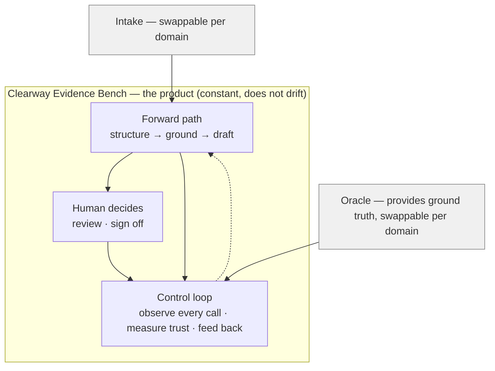
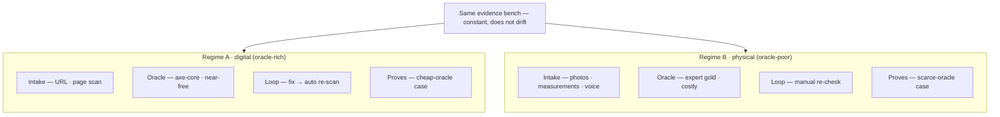

# Clearway — Design Note

*A trust-measurement bench for accessibility conformance, proven across two oracle regimes.*

> **Role of this document (the WHY).** This is the product rationale — scope, thesis, motivation. For build decisions see [`ARCHITECTURE.md`](ARCHITECTURE.md); for schemas see [`CONTRACTS.md`](CONTRACTS.md). Where this note's milestones (M1–M4) and `ARCHITECTURE.md`'s build sequence (M0–M6) differ, the latter is the refined, authoritative plan.

## 1. TL;DR

Clearway ingests raw signal, produces decision-ready, cited, confidence-scored evidence for a qualified human expert, and — critically — **measures and reports the trustworthiness of its own outputs**. The system never decides conformance; the expert does. The project starts from accessibility conformance (digital and physical); architecturally, the trust-measurement layer is kept separate from domain detail by design, so the same bench can later extend to other domains — but accessibility is the starting point and the focus of this document.

## 2. Problem & motivation

Accessibility evaluation is expensive because the bottleneck is not detecting problems but **documenting defensible findings**: mapping each issue to the correct legal/technical citation, writing remediation an implementer can act on, and assembling a standards-shaped report. Automated checkers detect only part of the problem space and cannot supply the judgment or the write-up. The market's expensive unit is therefore **expert-minutes-per-finding**.

There is also a regulatory tailwind. In April 2025 the U.S. FTC finalized a US$1,000,000 order against accessiBe for marketing an AI accessibility tool as able to "automatically comply" with WCAG; the order bars such claims "unless it has the evidence to substantiate" them. The lesson that matters here: an AI product that claims to **decide** accessibility is now legally exposed; an AI product that produces **substantiated evidence for a human to decide** is the defensible posture. Note: this tailwind benefits the entire category of honest, human-in-the-loop accessibility tools — it is a reason the posture is correct, not a competitive advantage unique to this project.

## 3. Goals & non-goals

**Goals**

- Demonstrate a working LLM/agentic system on a real problem, not a manufactured one.
- Make the eval & observability layer the load-bearing core — deep enough to produce real traces and an honest failure analysis.
- Compress expert-minutes-per-finding: the system produces decision-ready evidence so the expert approves/edits fast, rather than authoring from scratch.
- Prove the bench transfers across two oracle regimes (oracle-rich → oracle-poor) without drift.

**Non-goals**

- The system never renders a final conformance decision or legal conclusion. It supports the expert's judgment.
- No automated overlays / auto-remediation of live sites (the accessiBe failure mode).
- No construction cost estimation (see §6 scope).

## 4. Capabilities the system spans

Solving this problem happens to require four families of AI-engineering capability, used because the problem needs them — not to fit a framework:

- **LLM integration.** Tool-calling runs the checker (e.g., axe-core); structured output turns each violation into JSON and generates ACR/VPAT rows.
- **Retrieval grounding (RAG).** For each finding, retrieve the applicable success criterion, the correct citation, and the fix technique from a versioned standards corpus (WCAG 2.2 SC + Understanding + Techniques + ARIA APG; physical adds ADA 2010 + CBC 11B). Purpose: prevent hallucinated citations.
- **Orchestration + human-in-the-loop.** intake → scan → retrieve per finding → assess conformance + draft → flag low-confidence items → route to a human → assemble report.
- **Eval & observability.** (a) Hard-oracle regime: for checker-detectable issues, citation/conformance correctness is objectively checkable; fix → re-scan closes the loop. (b) Judge-calibration regime: calibrate the LLM-judge on expert gold labels; measure agreement/κ; catch bias. Plus observability: per-finding trace (retrieved SC, model, cost, confidence), citation-hallucination rate, edit-distance, accuracy over time.

## 5. Core thesis & product definition

**The product is measured trust, not the fixer.** Anyone can build the forward path (scan → retrieve → draft); dozens of tools already do. What is scarce is a system whose core output is a measurement of how far its own AI outputs can be trusted — citation-hallucination rate, expert edit-distance, confidence-vs-correctness calibration — in a domain where ground truth is partially free. The forward path is necessary scaffolding; the control loop is the point.

The architecture has two invariants and two variables:

- **Invariant (must not drift) = the bench.** The forward path, the control loop, the human-review gate, and the trust-metric definitions. This layer is domain-agnostic and is the product.
- **Variable (flexibility) = two swappable ports.** Intake (how raw signal enters) and oracle (where ground truth comes from). These change per domain.

*Figure 1. Clearway architecture — a constant bench (the product) with two swappable domain ports (Intake, Oracle). The dashed edge is the control loop feeding back.*

### The two oracle regimes

*Figure 2. The same bench across two oracle regimes — proving flexibility without drift.*

| | Regime A · digital (oracle-rich) | Regime B · physical (oracle-poor) |
|---|---|---|
| Intake | URL · page scan | photos · measurements · voice |
| Oracle | axe-core — automated, near-free | measurement-vs-code-threshold + expert gold labels — costly |
| Loop closure | fix → auto re-scan | manual re-check |
| Proves | bench works when the oracle is cheap | bench works when the oracle is scarce — the hard, common case |

**Key insight.** "Digital vs physical" is not the real oracle boundary — "has an automated checker or not" is. Website HTML is the only oracle-rich subset even within digital (see §6). Regime B is the more valuable demonstration because most real-world verticals lack a free oracle and look like B, not A.

## 6. Users & scope

**Users.** Primary user of the tool: a qualified accessibility specialist (a CASp for physical work; an IAAP-style specialist for digital) who owns the final decision. The tool's job is to hand them decision-ready evidence and shrink the time to approve or edit. The evaluated party (a business needing an audit/report) is the specialist's client, not a direct user of this system.

**In scope**

- Start with public website / web HTML only — the sole digital subset with a free automated oracle (axe-core), so the hard-oracle loop can be proven first.
- Evaluation & report as the core substrate: findings → ACR/VPAT-shaped output with correct citations, severity, and remediation.
- Implementation-side paperwork only: barrier-removal prioritization (following the DOJ four priorities) and policy/language templates — drafting tasks the bench can support.
- Later phase: Regime B (physical), kept deliberately thin (see discipline note).

**Out of scope**

- Construction cost estimation. It requires contractor/pricing knowledge absent from any retrievable corpus; producing numbers would create the exact failure mode we avoid — an authoritative-looking guess.
- Automated overlays / auto-remediation of live sites.
- Any final decision, legal conclusion, or compliance guarantee.

### Digital asset taxonomy & oracle structure

"Digital" is not only websites. The oracle structure differs by asset type — only website/web HTML is oracle-rich.

| Asset type | Free auto-oracle? | Regime | Phase |
|---|---|---|---|
| Public website / web HTML | Yes (axe-core) | A (oracle-rich) | first |
| Web application (post-login) | Partial | A→B | later |
| Mobile app (iOS/Android) | No (VoiceOver/TalkBack, manual) | B | later |
| PDF / documents | Weak | B | bridge |
| Design files (Figma/XD) | No | B | later |
| Multimedia (captions/AD) | No | B | later |

PDF is a useful bridge: it demonstrates the oracle-poor regime without leaving digital or touching the physical world.

### Discipline note on Regime B

B's success metric is "did the bench transfer cleanly under a scarce oracle?" — not "is the physical audit complete?" If the build drifts into exhaustive CBC coverage, B degrades into an orthogonal domain-knowledge sink. Include only enough physical substrate to prove no-drift under an oracle-poor regime.

## 7. Milestones (M1–M4)

> These are the note's original, coarse milestones. The build plan in [`ARCHITECTURE.md` §7](ARCHITECTURE.md) refines them into finer, dependency-ordered milestones (M0–M6); that is the authoritative sequence.

Sequencing logic: build the bench on the cheap oracle first (M1–M2), deepen the eval where it is hardest (M3), then prove transfer to the scarce-oracle regime (M4).

**M1 — Forward path + hard-oracle loop (website HTML).** Intake a URL → axe-core scan → normalize & de-duplicate into a canonical finding set → retrieve the correct SC + citation + technique → draft conformance + remediation via structured output → assemble ACR/VPAT rows. Hard-oracle eval: citation/conformance correctness is objectively checkable against the checker; fix → re-scan closes the loop.
- *Deliverable:* given a URL, output a decision-ready ACR draft with per-finding citations; report the citation-hallucination rate against ground truth.
- *Uses:* LLM integration, retrieval grounding (eval begins).

**M2 — Control loop + human review + observability.** Add the needs-review queue (axe-core incomplete items + low-confidence judgment items), the human approve/edit gate, per-finding traces (retrieved SC, model, cost, confidence), and a trust dashboard (citation-hallucination rate, edit-distance, accuracy over time). This is where the eval layer goes deep.
- *Deliverable:* the trust dashboard + a written eval report that includes an honest failure analysis (where the judge or retrieval failed, and why).
- *Uses:* orchestration + human-in-the-loop, eval & observability.

**M3 — Judge-calibration regime.** For the judgment items with no automated oracle, calibrate the LLM-judge against gold labels (self-built, or expert-provided — see §11); measure agreement/κ; surface confidence-vs-correctness calibration; detect systematic bias.
- *Deliverable:* a calibration report showing whether the system knows when it does not know — i.e., low confidence tracks low correctness.
- *Uses:* eval & observability (core).

**M4 — Cross-regime transfer proof (physical, thin).** Swap the intake (photos/measurements/voice) and the oracle (expert gold), keep the bench constant. Run the same trust-measurement loop on a small physical gold set. Deliver a side-by-side comparison of Regime A and Regime B — the "flexibility without drift" proof.
- *Deliverable:* the same bench running on a small physical gold set + a two-regime comparison.
- *Uses:* all four capabilities, on the bench (not on new domain features).

## 8. Evaluation & success metrics

This is the load-bearing section: the metrics below are the product's output, not a report card bolted on after.

| Metric | What it measures | Regime |
|---|---|---|
| Citation-hallucination rate | Share of findings citing a wrong/nonexistent SC or code section | A (hard oracle) |
| Conformance agreement | Machine vs ground-truth conformance level on checker-detectable issues | A |
| Loop closure rate | Issues that pass re-scan after the drafted fix | A |
| Expert edit-distance | How much the expert changes each draft (trend should fall) | A & B |
| Judge agreement / κ | LLM-judge vs expert gold on judgment items | B |
| Confidence calibration | Does low confidence track low correctness? | A & B |
| Per-finding trace | Retrieved SC, model, cost, latency, confidence — per call | A & B |

## 9. Anchor

The project is anchored on observation of a real accessibility practice — a boutique run by a specialist who is both a Certified Access Specialist (CASp) and an attorney, offering evaluation/report, implementation, and training across built, digital, and policy work. The observed service tiers (evaluation & report; implementation; training) informed the scope; the MVP maps to the digital evaluation-and-report slice. The anchor is what lets this project pass the "real pain" test rather than being solution-first.

## 10. Truth ledger

Included deliberately: the project's thesis is honesty about what AI can substantiate, so the document must be honest about what it has substantiated.

**Verified (sourced)**

- FTC final order vs accessiBe, US$1M, April 2025; bars "auto-comply" claims absent evidence. (FTC.gov)
- axe-core coverage: ~30% of WCAG by success criteria; ~57% by issue volume (Deque's framing). The two metrics differ; use "by criteria" when saying "minority."
- VPAT 2.5 (ITI, Nov 2023) aligns with WCAG 2.2; conformance levels: Supports / Partially Supports / Does Not Support / Not Applicable; the Remarks column carries the value.
- Physical: ADA Title III and CBC Title 24 Part 2 Ch 11B apply independently (dual applicability); Unruh Act minimum statutory damages US$4,000 per violation (Cal. Civ. Code §51(f)); DOJ four barrier-removal priorities; "readily achievable" is a fact-specific judgment.
- eval/observability tooling is a crowded, well-funded category (e.g., Braintrust US$80M Series B / US$800M, Feb 2026; Langfuse acquired by ClickHouse, Jan 2026).
- eval literacy is a top 2026 hiring signal, and domain-specific eval in regulated fields is in demand. (multiple 2026 hiring guides)

**Strategic inference (reasoning, not verified market fact)**

- "Measured trust is the product," the expert-minutes-per-finding value unit, and the cross-regime transfer thesis.

**Unverified — verify before relying**

- The exact CASp litigation-protection mechanism (grace period / "qualified defendant") and its statutory basis (CRASCA / Cal. Civ. Code §55.54) — seen on CASp vendor materials, not read from statute.
- Whether a public labeled physical accessibility gold set exists (unconfirmed).
- Competitor pricing figures are ~2022-era and may be stale.

## 11. What we need from a domain expert (for Regime B)

Framing for the expert: "This is a personal portfolio project; the tool only speeds up documentation and retrieval — the final judgment always rests with a qualified specialist. Below are the categories of resource needed to make the physical phase work, so you can indicate which are readily available and which need a public substitute. No commitment is requested."

| Need | Why | Fallback |
|---|---|---|
| 3–5 de-identified gold-label examples — each = site condition (photo/description) + measurement + applicable ADA §/CBC 11B § + conformance + severity + remediation. | This is Regime B's oracle; it turns "I computed κ" into "I calibrated against real expert gold." | Public DOJ ADA settlement documents + a self-built set spot-checked by any CASp. |
| One de-identified evaluation report template — structure/fields only, no client data. | So drafts look like what a specialist actually delivers, not an invented format. | Public CASp report templates (e.g., SF.gov / DGS). |
| ~30 min on judgment boundaries — e.g., "how do you draw the 'readily achievable' line in practice?"; "which barrier types would you never trust a tool to pre-judge?" | These unwritten, expert-only rules define which findings the bench must flag as low-confidence / must-review (the human-review gate). | Highest-value ask. Infer from public case law + CASp training materials (much weaker). |
| The truth on where the pain is — hours per evaluation report; the most tedious step; the step never to be delegated to a tool. | Validates that this is a real pain (project-validity test) and points the eval layer at what actually matters. | None — this is expert-only; ask it in person. |

## 12. Open questions

1. Does a usable public physical-accessibility gold set exist, or must it be self-built? (§10)
2. Should PDF be built as the oracle-poor bridge before physical, to prove the two regimes without leaving digital?
3. What is the minimum gold-set size for M3 calibration to be statistically meaningful (vs. a mechanism demo)?
