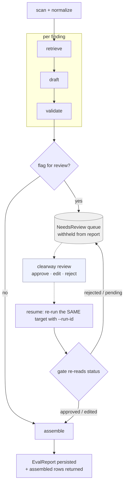

# Clearway orchestrator — durable control loop

The durable, checkpointed, resumable state machine that drives every finding through
retrieve → draft → validate (`ARCHITECTURE.md` §4.6). Not Temporal, not LangGraph — a hand-rolled
mini-harness over the same primitives, built to understand them and be able to say why those
frameworks exist.

> **Want to run or demo the pipeline?** The top-level [README](../../README.md#running-the-pipeline)
> is the single source for that — setup, the scan → review → resume walkthrough, and every command.
> This document is the **internals**: how the durable control loop works and why.

## Control flow

*Every step between `scan` and `assemble` is checkpointed, so a resume replays completed steps from
their cached result instead of recomputing them (see [Durable primitives](#durable-primitives)). The
dashed edges are the human-in-the-loop interrupt: a flagged finding waits in the queue until a
`clearway review` action resolves it and a resume flows it back through the gate.*

## Layout

- [`store.py`](store.py) — the `OrchestratorStore` seam: dumb persistence only. `PgOrchestratorStore`
  (Postgres, the same `clearway` database `corpus/store.py` uses) and `InMemoryOrchestratorStore`
  (the offline stand-in tests inject) both implement it. Holds the `run_state` / `step_state` durable
  checkpoints, the `needs_review` HITL queue, and the `eval_report` run history.
- [`machine.py`](machine.py) — the actual state machine, `execute()`. Checkpoints every step
  (`RunState`/`StepState`, `CONTRACTS.md` §3) to the store, retries transient failures with backoff,
  replays a completed step from its cached result instead of recomputing it on resume, and runs the
  HITL gate that flags a finding for human review post-validation.
- [`run.py`](run.py) — thin wrappers, `run()`/`run_set()`: scan → normalize, then one call into
  `execute()`; aggregate the resulting traces into an `EvalReport` and persist it at completion.

## Durable primitives

| Primitive | How |
|---|---|
| Retry + backoff | `max_attempts` / `backoff_seconds` params on `execute()` (default 3, exponential) — function parameters, not module constants, so tests can zero them out. |
| Idempotency | Keyed by `(run_id, finding_id, step)` — distinct from `Finding.id`'s cross-run content-hash dedup. Resuming a `run_id` skips/replays its completed steps; a fresh run of the same page reprocesses everything. |
| Checkpoint | Every step transition (status + attempts + result) is persisted before moving on to the next step. |
| Resume | `run()` / `run_set()` take an optional `run_id`: `None` starts fresh, an existing id resumes. The caller re-supplies the same target(s) — `RunState` carries no `targets` field, so resume relies on `Finding.id` being a deterministic hash to line back up with persisted rows. |
| Replay, not recompute | A step already checkpointed DONE is deserialized from its cached `result_json` and returned as-is — never re-run. This is what makes it a durable-execution primitive rather than a task tracker: Temporal's event-sourcing replay and LangGraph's state-checkpointing both persist step *output*, not just a status flag; a status-only checkpoint would be materially weaker. |

`result_json` lives on the `step_state` table but is store-internal, not a `CONTRACTS.md` field —
nothing outside this module reads it directly.

## Resuming a run

Resume is `run` / `eval` with an existing `--run-id` (the runnable step is in the
[README](../../README.md#running-the-pipeline)). Before proceeding, `execute()` prints
`resuming run <id>: N/M findings already complete, continuing from <finding_id>` — surfaced up
front, not just in a final summary.

Resume relies on the caller re-supplying the **same target** — `RunState` carries no `targets`
field, so it lines findings back up by their deterministic `Finding.id` hash. That is why `run` and
`eval` are *not* interchangeable on resume: `run <page-or-url>` re-scans *your* page, while `eval`
always re-scans the built-in `m1-core@1` fixture set regardless of `--run-id`. A live-URL run must
resume with `run <url> --run-id …`, never `eval`.

## Run history (persisted reports)

At completion each run persists its `EvalReport` (`CONTRACTS.md` §3) to the `eval_report` table,
keyed by `run_id` (PK). The report is stored whole as JSON with `created_at` lifted into its own
column, so history is queryable by run and by time without exploding every metric into a column.

This is the **data-production half** of the trust dashboard's accuracy-over-time trend (T6): M1's
Prometheus gauges carry no `run_id`, so successive runs blur together on a time series; a persisted
per-run row gives a true history you can query and trend. Because the key is `run_id`, a resumed run
(e.g. a post-approval reflow) overwrites its own row rather than duplicating it — the reflowed
metrics win, and the history never double-counts one run.

## HITL review gate (the durable interrupt)

The hand-rolled equivalent of LangGraph's `interrupt` (`ARCHITECTURE.md` §4.6). Evaluated in
`machine.py` **after** validation, once a finding's `DraftRow` + `CitationCheck`s exist. A finding is
flagged when one trigger fires — a single `reason` is stored, by precedence:

| Reason | Fires when | Status |
|---|---|---|
| `low_confidence` | `draft.confidence < 0.5` | **dead** — the calibration study found self-reported confidence decorative (pinned ~0.85–1.0 regardless of correctness), so it effectively never fires; a real signal must be *derived*, not calibrated (see the calibration report) |
| `axe_incomplete` | the finding came from axe's `incomplete` bucket (no oracle verdict) | effective |
| `unverifiable_judgment` | a citation is `UNVERIFIABLE` (valid SC, no oracle to check it) | effective |

**A `HALLUCINATED` citation is deliberately *not* a trigger.** The hard oracle catches it (L0/L1) and it
is honestly counted in `citation_hallucination_rate`, but *gating* it would withhold its `Trace` and drop
it from that metric — hiding the failure in the queue and flattering the headline, the same understatement
seen for `unverifiable_share` on a gated run. Until a composite (report ⊕ queue) metric exists, the honest
choice is to keep the hallucination **counted** (it ships, visibly wrong-cited) rather than **hidden**. So
a known-false citation is *measured* but still reaches the specialist — a documented gap, not an oversight.

On flag, a `NeedsReview(status=pending)` record (`CONTRACTS.md` §3) is persisted and **that finding is
withheld from the report** — the rest of the run continues. Because the record is durable, the queue
survives an orchestrator restart between flag and resolution.

A human works the queue through the separate `clearway review` entrypoint — `list` / `show` /
`approve` / `edit` / `reject`. The runnable commands and the review → resume walkthrough live in the
[README](../../README.md#running-the-pipeline); mechanically, these commands mutate the durable
`NeedsReview` record and print the exact resume command, but they do **not** re-scan — resume
re-supplies the target (see [Resuming a run](#resuming-a-run)).

On resume the gate reads the `NeedsReview` status back: `approved` assembles the original draft,
`edited` re-validates the human's `edited_draft` and assembles that, `pending` / `rejected` stay
withheld.

> **Do not `edit` then `approve`.** `edit` sets the status to `edited`, which the resume gate honors;
> `approve` sets it to `approved`, which assembles the **original** draft and silently discards your
> edit — even though `review show` still displays the edit as attached. To make an edit stick, use
> `edit` alone; use `approve` only for a draft you are keeping unchanged.

An `edited` review is also the raw material for the **`expert_edit_distance`** metric
(`eval/edit_distance.py`): a normalized `[0, 1]` `difflib` ratio over how far the human moved the
draft's `remediation` text (`0` = an unedited approval). The run mean folds onto
`EvalMetrics.expert_edit_distance` (`CONTRACTS.md` §3) and exports as a Prometheus gauge alongside the
hallucination rates — the human-correction signal the trust dashboard tracks over time.
